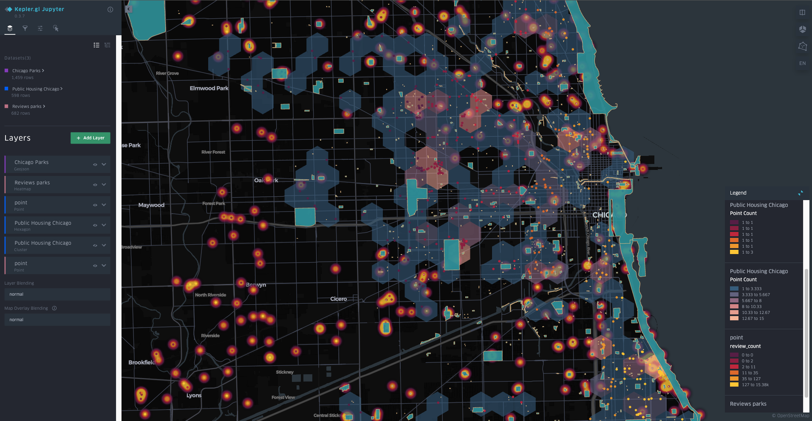

# Analyzing the Accessibility of Chicago Affordable Housing Units to High-Quality Green Spaces
Grace Kluender, Evan Fantozzi, Begum Akkas, Andrés Felipe Camacho

## Abstract
Public parks and green spaces bring communities together, offering places for recreation, social interaction, and personal well-being. Policymakers and urban planners have a critical responsibility to ensure equitable access to high-quality green spaces for residents of affordable housing. This project evaluates the accessibility of high-quality public parks and green spaces near affordable housing units in Chicago.

The Chicago Department of Housing maintains an updated list of affordable rental housing units, while OpenStreetMap provides spatial data on green spaces. Additionally, Yelp and Google APIs offer user-generated ratings for many of these spaces.

By integrating housing data with spatial and user review data, we develop an Accessibility Index that quantifies access to high-quality green spaces. This index considers key factors such as park ratings, size, and proximity to affordable housing developments, highlighting disparities in green space accessibility across the city. To make these insights more accessible, we create an interactive dashboard that visualizes the index, allowing users to explore the data and identify areas with limited park access.

This project offers policymakers and urban planners with a data-driven tool to identify areas where access to high-quality green spaces is limited, particularly for residents of affordable housing.

## Visualization

Here you can fin the current visualization of the project:




*To fill in with video of project*

# Data Sources

We are mainly using 4 data sources for the project. As we focus heavily on spatial
data to achieve a visualization of the index and make this a useful tool for urban
planning regarding the construction of affordable housing units, we gathered
information from:

1) OpenStreetMap Chicago Parks Data: The first set of data comes from OpenStreetMap, which is a free, open map
database (https://en.wikipedia.org/wiki/OpenStreetMap#:~:text=OpenStreetMap%20%28abbreviated%20OSM%29%20is%20a%20free%2C%20open%20map,and%20import%20from%20other%20freely%20licensed%20geodata%20sources). 

To extract coordinate data on Chicago green spaces and parks, we utilized the 
OSMnx API for Python (https://wiki.openstreetmap.org/wiki/OSMnx). 

Citation:
Boeing, G. (2024). Modeling and Analyzing Urban Networks and Amenities with OSMnx. Working paper. https://geoffboeing.com/publications/osmnx-paper/ 

2) Affordable Rental Housing Developments Data

3) Yelp API Review Data

4) Google Places API Review Data

## Instructions for Running Project

To properly run this project, please follow these steps: 

1) Clone the repository

``` 
git clone https://github.com/uchicago-2025-capp30122/30122-project-treehuggers.git
```

2) Syncoronize the libraries needed using ```uv```. This will install all the dependencies needed to run the code in the proyect

```
uv sync
```

3) (Optional) if there is a problem installing the dependency kepler, try this code that runs the project on a previuos version of python: 

```
deactivate #in case the virtual environment is active
rm -rf .venv
uv venv --python=python3.12
source .venv/bin/activate
uv sync
```

4) Check the structure of the project.
Up until febrary 23, the project strcture is as follows: 

```
.
├── README.md
├── data
│   ├── Affordable_Rental_Housing_Developments_20250201.csv
│   ├── OSM_output_archives
│   │   ├── OSM_park_relations.json
│   │   ├── OSM_park_ways.json
│   │   └── OSM_parks.json
│   ├── census_tracks
│   │   ├── il_tracts.cpg
│   │   ├── il_tracts.dbf
│   │   ├── il_tracts.ea.iso.xml
│   │   ├── il_tracts.prj
│   │   ├── il_tracts.shp
│   │   ├── il_tracts.shp.iso.xml
│   │   └── il_tracts.shx
│   ├── cleaned_park_polygons.geojson
│   ├── combined_reviews_clean.json
│   ├── google_field.json
│   ├── google_park.json
│   ├── housing.geojson
│   ├── load_housing_data.py
│   ├── park_polygons.geojson
│   ├── parks_polygons.geojson
│   ├── uncleaned_park_polygons.geojson
│   ├── yelp
│   │   └── combined_reviews_clean.json
│   ├── yelp_communitygardens.json
│   ├── yelp_dog_parks.json
│   ├── yelp_parks.json
│   └── yelp_playgrounds.json
├── data.geojson
├── hello.py
├── index
│   ├── parks_index.py
│   └── test_park_data.geojson
├── milestones
│   ├── milestone1.md
│   ├── milestone2.md
│   └── milestone3.md
├── notebooks
│   ├── CensusTracks.ipynb
│   ├── OSM.ipynb
│   ├── chicago_parks_kepler.html
│   └── demo.ipynb
├── pyproject.toml
├── scripts
│   ├── __init__.py
│   ├── archives
│   │   ├── OSM_OG_pull.py
│   │   └── OSM_overpass_request.py
│   ├── census_data
│   │   └── census_data.py
│   ├── clean_park_polygons.py
│   ├── combine_reviews.py
│   ├── create_parks_geojson.py
│   ├── google.py
│   └── yelp.py
├── tests
│   ├── data
│   │   └── test_park.json
│   └── test_yelp.py
├── uv.lock
└── viz
    ├── Viz23Feb2025.png
    ├── chicago_parks_kepler.html
    └── draft_vizualization.py
```


5) After reviewing the data is complete, the project can be run as a module (This step is still pending)


