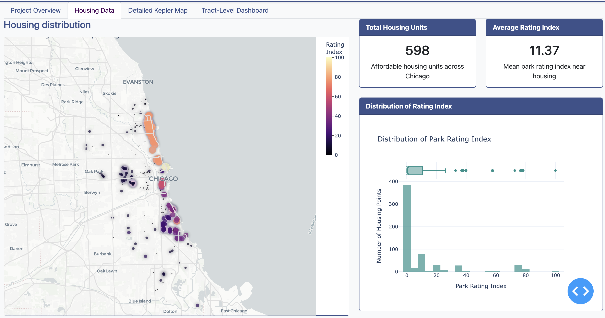
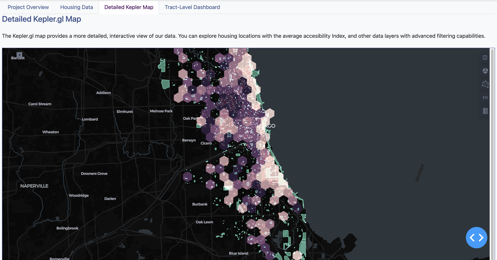
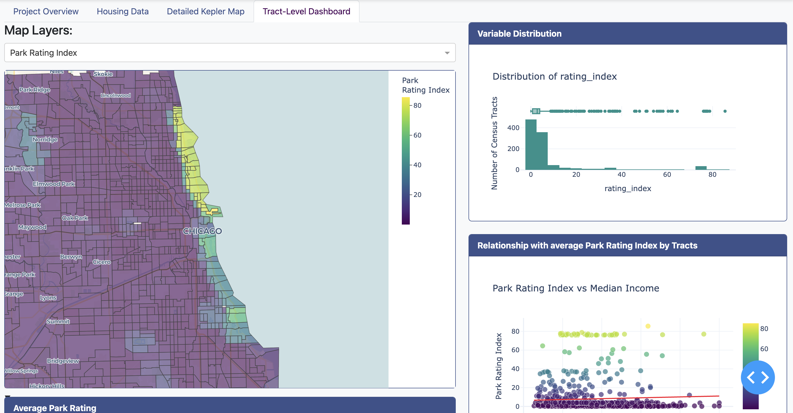

[University of Chicago - MSCAPP](https://capp.uchicago.edu/)

## Project Overview

Public parks and green spaces bring communities together, offering places for recreation, social interaction, and personal well-being. Policymakers and urban planners have a critical responsibility to ensure that residents of affordable housing have equitable access to high-quality green spaces. This project evaluates the `accessibility` of high-quality public parks and green spaces near affordable housing units in Chicago, compared to other areas across the city.

By integrating Chicago housing data and census tract data with spatial and review data on green spaces, we develop an `Accessibility Index` that quantifies access to high-quality green spaces. This index accounts for key factors such as park ratings, size, and proximity to affordable housing developments and census tracts, revealing disparities in green space accessibility throughout the city.

To make these insights actionable, we also create an `interactive dashboard` that visualizes the index, enabling users to explore the data and pinpoint areas with limited access to green spaces.

Ultimately, this project equips policymakers and urban planners with a data-driven tool to identify and address gaps in access to high-quality green spaces, especially for residents of affordable housing.

## Methodology

Our approach combines several analytical techniques:

1. **Geospatial Analysis**: Mapping parks and demographic data by census tract to visualize distribution patterns
2. **Accessibility Index**: Creating an Accesibility Index for each affordable housing unit and census tract based on green space proximity, size, and user review data.
3. **Statistical Analysis**: Visualizing relationships between park metrics and demographic variables
4. **Interactive Visualization**: Building interactive dashboards to explore data patterns and relationships

## Data Sources

- **Chicago Green Space Data**: Chicago green space locations and boundaries from OpenStreetMap
- **Demographic Data**: Demographic data by census tract (income, population density) from the U.S. Census Bureau
- **Affordable Housing Data**: Affordable Rental Housing Developments Data from the city of Chicago's data portal
- **Review Data**: Aggregated review scores on green spaces from Google and Yelp

## Explore the `dashboard`

This dashboard provides multiple ways to explore our findings:

- **Housing data**: Explore the spatial distribution of affordable housing and our acessibility index

- **Detailed Kepler Map**: Deep dive in the housing, index, and park proximity with `keplerGL` rendering

- **Tract-Level Dashboard**: Examine distribution patterns and relationships between variables

*Project by Team TreeHuggers - [University of Chicago MSCAPP](https://capp.uchicago.edu/)*